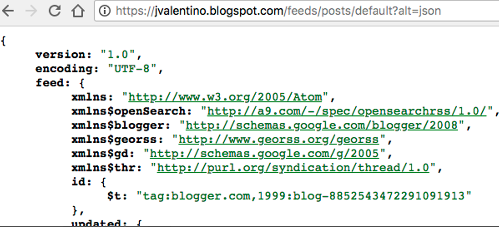

## 4.9 Getting Web Content

Gradle plugins sometimes need the ability to obtain information from other data sources, specifically web services. The purpose of this plugin is to demonstrate how to get data from a web location, and how to handle the testing of that interaction in a unit test. The plugin function of this plugin to pull the publish date/times of posts on a blog, using its JSON-based REST interface.

 

##### Target Content



The target content is the JSON representation of a blog’s RSS feed.

 

#### src/main/groovy/com/blogspot/jvalenitno/gradle/BloggerTask.groovy

```groovy
class BloggerTask extends DefaultTask {

    BloggerTask instance = this

    String title
    List<String> postDateTimes = []

    @TaskAction
    void perform() {
        String url = instance.project.properties.url

        String jsonText = new URL(url).text

        Map json = new JsonSlurper().parseText(jsonText)

        title = json.feed.title['$t']

        int entryCount = 0
        json.feed.entry.each { Map entry ->
            if (entryCount < 5) {
                postDateTimes.add(entry.published['$t'])
            }
            entryCount++
        }

        println "Title: ${title}"
        for (String dateTime : postDateTimes) {
            println "Post Date/Time: ${dateTime}"
        }
    }
}

```

**Line 22: URL through properties**

The strategy of getting the **project** variable via the **instance** self-reference is used, so that project can be easily mocked. This is because the task relies on getting the URL through the “url” property, which can be given either as a “-P” parameter at the command-line, or as a value in gradle.properties.

 

**Line 24: Getting the text content of a URL**

Groovy adds a “text” method to the URL class, which handles returning the text content of that URL.

 

**Lines 26-41: The logic**

Converts the text into a Map using the **JsonSluper**, uses the map to determine the blog title, and the date/times of its posts, then displays that at the command-line.

 

#### plugin-tests/local/build.gradle

```groovy
buildscript {
  repositories {
	jcenter()
  }
  dependencies {
    classpath 'com.blogspot.jvalentino.gradle:http-demo:1.0.0'
  }
}

apply plugin: 'http-demo'

```

Since the settings.gradle files declares the plugin project as a dependency, this using build.gradle only has to specify the plugin classpath and apply the plugin.

 

#### Manual Testing

```bash
plugin-tests/local$ gradlew -Purl="https://jvalentino.blogspot.com/feeds/posts/default?alt=json" blogger

> Task :blogger 
Title: Software Everything
Post Date/Time: 2015-04-02T09:17:00.002-06:00
Post Date/Time: 2014-12-29T07:31:00.002-06:00
Post Date/Time: 2014-12-24T07:31:00.002-06:00
Post Date/Time: 2014-12-17T07:31:00.002-06:00
Post Date/Time: 2014-12-15T11:31:00.002-06:00


BUILD SUCCESSFUL

```

When executing the custom task at the command line with the URL of https://jvalentino.blogspot.com/feeds/posts/default?alt=json, it displayed the publish date/times of the first 5 posts.

 

#### src/test/resources/blogger.json

```json
{
	"feed": {
		"title": {
			"$t": "Blah Blah Blah"
		},
		"entry": [
			{
				"published": {
					"$t": "2015-04-06T09:17:00.002-06:00"
				}
			},
			{
				"published": {
					"$t": "2015-04-05T09:17:00.002-06:00"
				}
			},
			{
				"published": {
					"$t": "2015-04-04T09:17:00.002-06:00"
				}
			},
			{
				"published": {
					"$t": "2015-04-03T09:17:00.002-06:00"
				}
			},
			{
				"published": {
					"$t": "2015-04-02T09:17:00.002-06:00"
				}
			},
			{
				"published": {
					"$t": "2015-04-01T09:17:00.002-06:00"
				}
			}
		]
	}
}

```

Since we are relying on calling a web service as a part of our task, we need to have at least one result storied as a part of our test. Since the task in question is only interested in the title and last 5 publish date/times, I created an JSON representation of the RS feed, but only containing title and publish date/times.

 

#### src/test/groovy/com/blogspot/jvalenitno/gradle/BloggerTaskTestSpec.groovy

```groovy
class BloggerTaskTestSpec extends Specification {

    @Subject
    BloggerTask task
    Project project
    
    def setup() {
        Project p = ProjectBuilder.builder().build()
        task = p.task('blogger', type:BloggerTask)
        task.instance = Mock(BloggerTask)
        project = Mock(ProjectInternal)
    }

```

**Lines 12-21: Standup setup**

The subject of the test and the **project** are kept as member variables, while the instance strategy for mocking self-reference is used. Additionally, the project is mocked to be used to later handle properties.

```groovy
    void "Test perform"() {
        given:
        Map properties = ['url':'https://foo.com']
        URL.class.metaClass.getText = { 
            new File('src/test/resources/blogger.json').text 
        }
        
        when:
        task.perform()
        
        then:
        1 * task.instance.project >> project
        1 * project.properties >> properties
        
        and:
        task.title == 'Blah Blah Blah'
        task.postDateTimes.size() == 5
        task.postDateTimes.get(0) == '2015-04-06T09:17:00.002-06:00'
        task.postDateTimes.get(1) == '2015-04-05T09:17:00.002-06:00'
        task.postDateTimes.get(2) == '2015-04-04T09:17:00.002-06:00'
        task.postDateTimes.get(3) == '2015-04-03T09:17:00.002-06:00'
        task.postDateTimes.get(4) == '2015-04-02T09:17:00.002-06:00'
    }

```

**Line 25: Properties**

A property map is created to represent the later return of **project.properties**, containing the URL to use.

 

**Lines 26-28: URL metaprogramming**

The URL class cannot be mocked in Spock using **Mock** or **GroovyMock**. The result is that another methodology must be used in order to deal with it. A feature of Groovy that can be used is metaprogramming, which allows the changing of existing class definitions. Specifically, the definition of the **getText**() can be overridden for all instances of URL to return the text content of our earlier JSON rest response.

 

**Lines 30-31: perform**

Executes the method under test.

 

**Lines 34-35: Property mocking**

The standard strategy for mocking the self-reference to return a mocked project instance, to then return the setup properties is used.

 

**Lines 27-44: Assertions**

Asserts that the test JSON file was retrieved and parsed, where the title and the last five date/times are asserted.

